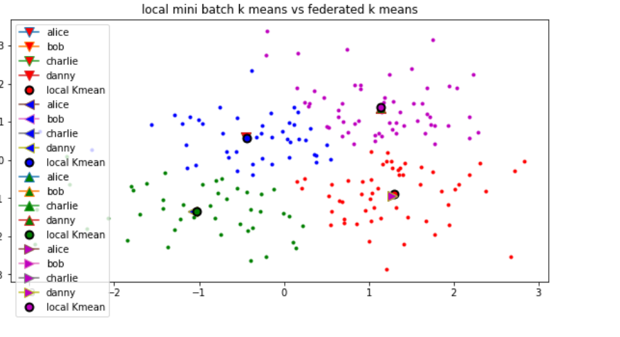

# Implementation of Federerated K-means and its comparison with local k-means

## K-means algorithm

Common clustering algorithm that uses mean of euclidian distances to distinguish several clusters.

## Demonstration

I provided here a notebook comparing the results of a Federated k-means simulation with a local k-mean, using `sklearn mini batch k -means` algorithm. 
I tracked the evolution of euclidian distance over several rounds, compared the k-means objective function and the Davie Boulin.

## Results

This results are shown for 4 clients (alice, bob, charlie, danny), and for `k=4`.
Each client gives the position of the computed mean cluster.

## Limitations

Even if Federated k-means converges, this poc suffers from secrutiy issues:
if `k=n_samples`, then it will be possible to extract all points. One could use a Ssecure Aggregation method to mitigate this edge case.
